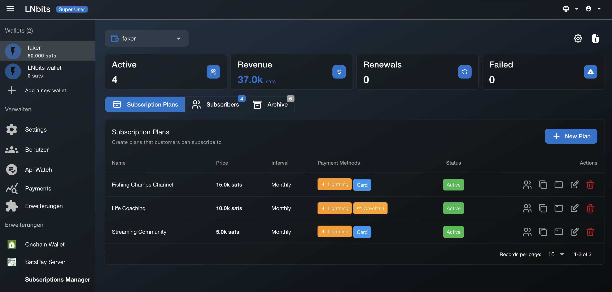

# Subscriptions Manager

Recurring subscription payments for your service via [LNbits](https://github.com/lnbits).

## About

Subscriptions Manager is a powerful LNbits extension for managing recurring payments. Whether you're a content creator, community manager, freelancer, or running a SaaS product, this extension handles your subscription billing automatically.

**No coding. No complicated setup. Just create, share, get paid.**

---

## Table of Contents

- [About](#about)
- [Features](#features)
- [Documentation](#documentation)
- [Installation](INSTALLATION.md)
- [Requirements](#requirements)
- [Support](#support)
- [License](#license)
- [Contributors](#contributors)

---

## Features

- Create and manage custom subscription plans (weekly, monthly, yearly)
- Accept payments in Bitcoin (Lightning & on-chain) and fiat (Stripe/PayPal)
- Clean, simple checkout experience for subscribers
- Self-service portal for subscribers to manage their subscriptions
- Trial periods and grace periods for flexibility
- Multi-channel notifications (Email, Telegram, Webhooks, Nostr)
- Track active subscriptions, revenue, and payment history
- Full API for custom integrations

---

## Documentation

**Full documentation available at: [docs-subscriptions.netlify.app](https://docs-subscriptions.netlify.app)**

| Document | Description |
|----------|-------------|
| [Installation](INSTALLATION.md) | How to get started |
| [Use Cases](USE_CASES.md) | What you can do, real examples |
| [Guide](GUIDE.md) | Setup, configuration, daily usage |

For API documentation and developer resources, please visit the [full documentation site](https://docs-subscriptions.netlify.app).

---

## Install

See the [Installation Guide](INSTALLATION.md) for detailed setup instructions.

---

## Requirements

- LNbits 1.4.0+
- Python 3.10+
- Optional: WatchOnly + SatsPay (on-chain payments)
- Optional: Stripe/PayPal enabled by server admin (fiat payments)

---

## Support

**Found a bug? Have a feature request?**

Please open an issue on this repository: [GitHub Issues](https://github.com/DoktorShift/Subscriptions-Manager/issues)

**Want to support development?**

`u60311@blink.sv`

---

## License

This is proprietary software requiring a valid license for use. See [LICENSE](LICENSE) for terms.

---

## Contributors

[DoktorShift](https://github.com/DoktorShift) · [Pratik227](https://github.com/Pratik227)

---

## LNbits inside!

LNbits empowers everyone with modular, open-source tools for building Bitcoin-based systems — fast, free, and extendable.

